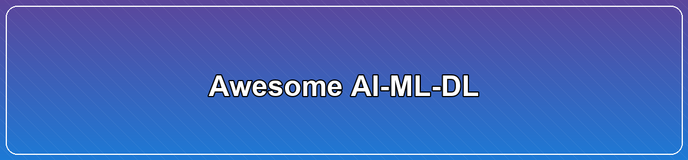

# Awesome AI-ML-DL  

Navigation: [Home](./README.md) · 🗂️ [Reference](./reference/README.md) · ☁️ [Infrastructure](./infrastructure/README.md) · 📓 [Notebooks](./notebooks/README.md) · 🧰 [Tools](./tools/README.md) · 📊 [Data](./data/README.md) · 🤖 [Agents](./ai-agents/README.md) · 🧠 [NLP](./natural-language-processing/README.md)

> Learn, build, and explore AI/ML/DL with curated guides, domains, tools, and examples.

## Table of Contents

- [What's new](#whats-new)
- [Start here](#start-here)
- [Explore by domain](#explore-by-domain)
- [Legacy content (full index)](#legacy-content-full-index)
  - [Python](#python)
  - [Java & JVM](#java--jvm)
  - [Other Languages](#other-languages)
- [AI & Machine Learning](#ai--machine-learning)
  - [Core Topics](#core-topics)
  - [Specialized Areas](#specialized-areas)
  - [Ethics & Governance](#ethics--governance)
- [Data & Analytics](#data--analytics)
  - [Data Science](#data-science)
  - [Visualization](#visualization)
- [Learning Resources](#learning-resources)
  - [Courses & Competitions](#courses--competitions)
  - [Guides & Tutorials](#guides--tutorials)
  - [Reference Materials](#reference-materials-1)
- [Tools & Infrastructure](#tools--infrastructure)
  - [Development Tools](#development-tools)
  - [Cloud & DevOps](#cloud--devops)
  - [Frameworks & Libraries](#frameworks--libraries)
  - [Testing & Quality](#testing--quality)
- [Reference Materials](#reference-materials)
  - [Mathematical Foundations](#mathematical-foundations)
  - [Automation & MLOps](#automation--mlops)
  - [Miscellaneous](#miscellaneous)
- [Contributing](#contributing)
- [Sponsoring](#sponsoring)
- [Disclaimer](#disclaimer)

[↑ Back to top](#awesome-ai-ml-dl)

## What's new

<!-- whatsnew:start -->
- Assets: resize banners to 1200x280 and regenerate (`42671a1`)
- Design: aesthetic overhaul for banners (gradients, per-domain palettes, typography) (`195327d`)
- Assets: reduce banner height to 1200x360 and regenerate images (`84d9cc8`)
- Assets: generate placeholder banner PNGs and add generator script (`903435c`)
- Docs: add banner references to all domain landing pages (`4eeb19b`)
- Docs: add banner references to root, Reference, Infrastructure, and Domains index (`6cda8e5`)
- Chore: scaffold assets/banners/ with README and .gitkeep (`1968100`)
- Template: add section header, nav, and badges to domains/time-series/README.md (`081ee5e`)
- Polish: add Shields.io badges to Data, Tools, and Notebooks READMEs (`c223509`)
- Polish: add Shields.io badges to Reference, Infrastructure, Domains index and domain landing pages (`d5208e9`)
<!-- whatsnew:end -->

## Start here

- Python and Data basics: [Python](./python/README.md) · [Data](./data/README.md)
- Core topics: [ML](./reference/julia-python-and-r.md#machine-learning) · [DL](./reference/julia-python-and-r.md#deep-learning) · [NLP](./natural-language-processing/README.md)
- Do stuff: [Notebooks](./notebooks/README.md) · [Examples](./examples/README.md) · [Tools](./tools/README.md)

## Explore by domain

- 🤖 [AI Agents](./domains/ai-agents/README.md) · 🧠 [NLP](./domains/nlp/README.md)
- 🖼️ [Computer Vision](./domains/computer-vision/README.md) · 🏗️ [LLMs](./domains/large-language-models/README.md)
- ✨ [Generative AI](./domains/generative-ai/README.md) · 🚀 [MLOps & Deployment](./domains/mlops-deployment/README.md)
- ⏱️ [Time Series & Anomaly Detection](./domains/time-series/README.md)

---

Better NLP: 

NLP Java:  | NLP Clojure:  | NLP Kotlin:  | NLP Scala:  |  
NLP using DL4J (cuda) 

Tribuo:  | DeepNetts:  | Dataiku DSS:  | Grakn:  | Jupyter-Java:  |  
MLPMNist using DL4J:  | Zeppelin: 

---

Awesome Artificial Intelligence, Machine Learning and Deep Learning as we learn it. Study notes and a curated list of awesome resources of such topics.

**This repo is dedicated to engineers, developers, data scientists and all other professions that take interest in AI, ML, DL and related sciences. To make learning interesting and to create a place to easily find all the necessary material. Please contribute, watch, star, fork and share the repo with others in your community.**

**Watching the repo will keep you posted of all the changes (commits) that go into the repo.**

**Also, please [SPONSOR us, find out how-to](https://github.com/sponsors/neomatrix369)!**

<strong>Legacy content (full index)</strong> - Click to expand

## Legacy content (full index)

### Python
- [Python for AI/ML/DL](./python/README.md) - Comprehensive Python guide for AI/ML/DL
- [Programming in Python](Programming-in-Python.md) - Redirect to new Python guide
- [Python Performance](Python-Performance.md) - Redirect to performance section

### Java & JVM
- [Java](./reference/java-jvm.md#javajvm)
  - [Business / General / Semi-technical](./reference/java-jvm.md#business--general--semi-technical)
  - [Classifier / decision trees](./reference/java-jvm.md#classifier--decision-trees)
  - [Correlated Cross Occurrence](./reference/java-jvm.md#correlated-cross-occurrence)
  - [Genetic Algorithms](./reference/java-jvm.md#genetic-algorithms)
  - [Java projects / related technologies](./reference/java-jvm.md#java-projects--related-technologies)
  - [Natural Language Processing (NLP)](./natural-language-processing/java-jvm.md#javajvm)
  - [Neural Networks](./reference/java-jvm.md#neural-networks)
 	    - Convolutional Neural Networks (CNN)
 	    - Long Short Term Memory (LSTM)
 	    - Recurrent Neural Network (RNN)
  - [Recommendation systems / Collaborative Filtering (CF)](./reference/java-jvm.md#recommendation-systems--collaborative-filtering-cf)
  - [Data Science](./reference/java-jvm.md#data-science)
  - [Machine Learning](./reference/java-jvm.md#machine-learning)
    - [Deep learning](./reference/java-jvm.md#deep-learning)
       - [Reinforcement learning](./reference/java-jvm.md#reinforcement-learning)
    - [ML on Code/Programm/Source Code](./reference/ML-on-code-programming-source-code.md)
  - [Tools & Libraries, Resources](./reference/java-jvm.md#tools--libraries-other-resources)
  - [How-to / Deploy / DevOps / Serverless](./reference/java-jvm.md#how-to--deploy--devops--serverless)
  - [Misc](./reference/java-jvm.md#misc)
- [Clojure](./reference/java-jvm.md#clojure)
- [Scala](./reference/java-jvm.md#scala)

### Other Languages
- [Julia, Python, GoLang & R](./reference/julia-python-and-r.md#julia-python-and-r)
  - [General](./reference/julia-python-and-r.md#general)
  - [Generative Adversarial Network (GAN)](./reference/julia-python-and-r.md#generative-adversarial-network-gan)
  - [Genetic Algorithms](./reference/julia-python-and-r.md#genetic-algorithms)
  - [RNN](./reference/julia-python-and-r.md#rnn)
  - [Natural Language Processing (NLP)](./reference/julia-python-and-r.md#natural-language-processing-nlp)
  - [Computer Vision (CV)](./reference/julia-python-and-r.md#computer-vision)
  - [Data Science](./reference/julia-python-and-r.md#data-science)
  - [Machine learning](./reference/julia-python-and-r.md#machine-learning)
    - [Deep learning](./reference/julia-python-and-r.md#deep-learning)
      - [Reinforcement learning](./reference/julia-python-and-r.md#reinforcement-learning)
    - [ML on Code/Programm/Source Code](./reference/ML-on-code-programming-source-code.md)
- [AI in Golang](./reference/julia-python-and-r.md#programming-in-golang)
- [More...](./reference/julia-python-and-r.md#more)
- [JavaScript](README-details.md#javascript)

## AI & Machine Learning

### Core Topics
- [Artificial Intelligence](README-details.md#artificial-intelligence)
- [Machine Learning](./reference/julia-python-and-r.md#machine-learning)
- [Deep Learning](./reference/julia-python-and-r.md#deep-learning)
- [Natural Language Processing (NLP)](./natural-language-processing/README.md)
- [Computer Vision (CV)](./reference/julia-python-and-r.md#computer-vision)
- [Reinforcement Learning](./reference/julia-python-and-r.md#reinforcement-learning)

### Specialized Areas
- [AI Agents](./ai-agents/README.md)
- [Generative AI](./domains/generative-ai/README.md)
- [Large Language Models](./domains/large-language-models/README.md)
- [Computer Vision](./domains/computer-vision/README.md)
- [Time Series & Anomaly Detection](./domains/time-series/README.md)

### Ethics & Governance
- [Ethics / altruistic motives](README-details.md#ethics--altruistic-motives)
- [Ethics & Governance](./blogs/ethics-governance/README.md)

## Data & Analytics

### Data Science
- [Data Science](./reference/julia-python-and-r.md#data-science)
- [Data](./data/README.md)
- [Data Analysis Tools](./tools/README.md#data-analysis-tools)

### Visualization
- [Visualisation](./reference/visualisation.md#visualisation)
- [Graphs](README-details.md#graphs)

## Learning Resources

### Courses & Competitions
- [Courses](courses.md)
- [Competitions](competitions.md)
- [Study notes](./study-notes/README.md#study-notes)

### Guides & Tutorials
- [Guides](guides.md#guides)
- [Things to Know](things-to-know.md) - Essential knowledge and best practices
- [Blogs & Articles](./blogs/README.md) - Articles, tutorials, and blog posts
  - [AI Coding Tools](./blogs/ai-coding-tools/README.md) - Claude, MCP, Cursor setup guides
  - [PulseMark](https://pulsemark.ai) - Daily AI news, model benchmarks, developer tool comparisons, and tutorials for ML practitioners
  - [Tutorials](./blogs/tutorials/) - Step-by-step tutorials

### Reference Materials
- [Cheatsheets](./reference/cheatsheets.md#cheatsheets)
- [Articles, papers, code, data, courses](./reference/articles-papers-code-data-courses.md#articles-papers-code-data-courses)
- [Research Papers](./papers/README.md) - Curated research papers and academic resources
- [Presentations](./presentations/README.md) - Slide decks and talk links
- [Models](README-details.md#models)
- [Notebooks](./notebooks/README.md#notebooks)
- [Examples](./examples/README.md) - Code examples and implementations

## Tools & Infrastructure

### Development Tools
- [Tools & Technologies](./tools/README.md) - Comprehensive guide to AI/ML/DL tools
- [AI Coding Tools](./blogs/ai-coding-tools/README.md) - Claude, MCP, Cursor resources
- [AI Coding Tools References](./blogs/ai-coding-tools/COMMON-REFERENCES.md) - MCP, Claude, Cursor resources

### Cloud & DevOps
- [Cloud, DevOps, Infra](infrastructure/cloud-devops-infra/README.md#cloud-devops-infra)
- [Cloud Infrastructure](./infrastructure/README.md)
- [MLOps & Deployment](./domains/mlops-deployment/README.md)

### Frameworks & Libraries
- [Frameworks & Libraries](./tools/README.md#machine-learning-frameworks)
- [Machine Learning](./reference/julia-python-and-r.md#machine-learning)
- [Deep Learning](./reference/julia-python-and-r.md#deep-learning)

### Testing & Quality
- [Tests & Testing](./reference/julia-python-and-r.md#testing)
- [Best Practices](README-details.md#best-practices)
- [WFGY Problem Map](https://github.com/onestardao/WFGY/blob/main/ProblemMap/README.md) - Structured 16-problem checklist for diagnosing common RAG and LLM failure modes.

## Reference Materials

### Mathematical Foundations
- [Mathematics, Statistics, Probability & Probabilistic programming](./reference/maths-stats-probability.md#mathematics-statistics-probability--probabilistic-programming)
- [Mathematica](./reference/mathematica-wolfram-Language.md#mathematica--wolfram-language)

### Automation & MLOps
- [Automation](README-details.md#automation)
- [Deployment & MLOps](./tools/README.md#deployment--mlops)

### Miscellaneous
- [Misc](./reference/misc.md#misc)
- #contributing
- #sponsoring

# Contributing

Contributions are very welcome, please share back with the wider community (and get credited for it)!

Please have a look at the [CONTRIBUTING](CONTRIBUTING.md) guidelines, also have a read about our [licensing](LICENSE.md) policy.

# Sponsoring

With [GitHub's new project sponsor program](https://github.com/sponsors) you can now sponsor projects like this, [see how](https://github.com/sponsors/neomatrix369).

# Disclaimer

**Important Notice:**

- **Content Accuracy:** The information, resources, and links provided in this repository are curated from various sources and are subject to change. While we strive to maintain accuracy and keep content up-to-date, we cannot guarantee that all information is current, correct, or complete at all times.

- **Third-Party Content:** This repository contains references, links, and citations to external sources, articles, tools, libraries, and resources created by third parties. We do not own or claim ownership of this external content. All credit belongs to the original authors and creators.

- **No Warranty:** The content is provided "as is" without warranty of any kind, express or implied. We make no representations or warranties regarding the accuracy, reliability, or completeness of any information provided.

- **Verification Recommended:** Users are strongly encouraged to verify information, test tools and code, and refer to official documentation before using any resources in production environments or critical applications.

- **Rapidly Evolving Field:** AI, ML, and DL are rapidly evolving fields. Tools, best practices, and technologies mentioned here may become outdated. Always check for the latest versions and updates from official sources.

- **No Professional Advice:** Nothing in this repository constitutes professional, legal, or technical advice. Users should consult with qualified professionals for specific guidance related to their use cases.

- **Community Contributions:** This is a community-driven project. Content may be contributed by various individuals. If you find errors, outdated information, or have suggestions for improvements, please see our [Contributing Guidelines](CONTRIBUTING.md).

**Use at Your Own Risk:** By using this repository, you acknowledge and accept these disclaimers and agree to use the information and resources at your own discretion and risk.

[↑ Back to top](#awesome-ai-ml-dl)

## 🌐 Web Resources & Interactive Index
- [INDEX22](https://quizzesarena.web.app/index22.html)
- [HALLOWEEN MERGE MANIA](https://thebrainquests-hi.pages.dev/halloween-merge-mania.html)
- [COLOR MAZE](https://quizzesarena.onrender.com/color-maze.html)
- [CATEGORY SIMULATION 4](https://quizzesarena.web.app/category-simulation-4.html)
- [ANCIENT WARS CAESAR](https://learnplay-pt.pages.dev/ancient-wars-caesar.html)
- [CATEGORY HERO72](https://eduplay-es.pages.dev/category-hero72.html)
- [CATEGORY SOLITAIRE27](https://studyarcade-vi.pages.dev/category-solitaire27.html)
- [OBBY ESCAPE PRISON RAT DANCE](https://eduquestsfr.pages.dev/obby-escape-prison-rat-dance.html)
- [SURVEV](https://quizzesarena.onrender.com/survev.html)
- [POPTROPICA](https://theknowledgequests9.pages.dev/poptropica.html)
- [TWO STUNT SUPERCARS](https://studyarcade-vi.pages.dev/two-stunt-supercars.html)
- [GLADIATORS MERGE AND FIGHT](https://theplayandlearns-fr.pages.dev/gladiators-merge-and-fight.html)
- [CATEGORY BRAIN261](https://eduquestsfr.pages.dev/category-brain261.html)
- [CATEGORY ROGUELIKE38](https://studyquest-ja.pages.dev/category-roguelike38.html)
- [GRASS LAND](https://learnplay-pt.pages.dev/grass-land.html)
- [RACING BALL ADVENTURE](https://learnquest-ru.pages.dev/racing-ball-adventure.html)
- [WORLD WARS TANKS](https://studyarcade-vi.pages.dev/world-wars-tanks.html)
- [HAWAII MATCH 5](https://lessonplay-fr.pages.dev/hawaii-match-5.html)
- [MADNESS SHERIFFS COMPOUND OFFICIAL](https://thestudyquests-ja.pages.dev/madness-sheriffs-compound-official.html)
- [LAST PLAY RAGDOLL SANDBOX KQB](https://studyquest-ja.pages.dev/last-play-ragdoll-sandbox-kqb.html)
- [CATEGORY CASUAL 9](https://learnplay-pt.pages.dev/category-casual-9.html)
- [CHRISTMAS CANDY ESCAPE 3D](https://eduquestsfr.pages.dev/christmas-candy-escape-3d.html)
- [TWO RX7 DRIFTERS](https://eduquestsfr.pages.dev/two-rx7-drifters.html)
- [EASY OBBY JUMP AND RUN CHALLENGE ONLINE](https://brainquestsfr.pages.dev/easy-obby-jump-and-run-challenge-online.html)
- [STICKMAN JAILBREAK STORY](https://brainquest-hi.pages.dev/stickman-jailbreak-story.html)
- [LAST PLAY RAGDOLL SANDBOX KQB](https://eduplay-es.pages.dev/last-play-ragdoll-sandbox-kqb.html)
- [FISH STORY 4](https://mindconvertpt.pages.dev/fish-story-4.html)
- [SOKOBAN PUSH THE BOX](https://quizzesarena.onrender.com/sokoban-push-the-box.html)
- [YUMMY TALES 3](https://brainquestskr.pages.dev/yummy-tales-3.html)
- [CATEGORY BUILDING179](https://eduquestsfr.pages.dev/category-building179.html)
- [CATEGORY ADVENTURE 3](https://thelearnquests-ru.pages.dev/category-adventure-3.html)
- [LUXURY HIGHWAY CARS](https://eduquestsfr.pages.dev/luxury-highway-cars.html)
- [FIND IT IN THE HAUNTED MANSION](https://thelearningarcades-en.pages.dev/find-it-in-the-haunted-mansion.html)
- [BFFS CHERRY BLOSSOM CELEBRATION](https://brainquestspt.pages.dev/bffs-cherry-blossom-celebration.html)
- [CATEGORY BASKETBALL](https://eduquest-ko.pages.dev/category-basketball.html)
- [CATEGORY CASUAL 6](https://eduquest-ko.pages.dev/category-casual-6.html)
- [CATEGORY MOBILE2 095](https://theeduquests-ko.pages.dev/category-mobile2-095.html)
- [ZEN TILE](https://theplayandlearns-fr.pages.dev/zen-tile.html)
- [BUILD AND RUN](https://quizzesarena.onrender.com/build-and-run.html)
- [INDEX28](https://eduquestsfr.pages.dev/index28.html)
- [COLOR BUMP DANCER](https://quizzesarena.onrender.com/color-bump-dancer.html)
- [BUBBLE SHOOTER GO](https://quizzesarena.onrender.com/bubble-shooter-go.html)
- [NUMBER MASTER RUN AND MERGE](https://playandlearn-fr.pages.dev/number-master-run-and-merge.html)
- [CATEGORY SHOOTER](https://brainquestsjp.pages.dev/category-shooter.html)
- [HOME ISLAND](https://studyquest-ja.pages.dev/home-island.html)
- [WOOD BLOCKS JAM](https://learnquest-ru.pages.dev/wood-blocks-jam.html)
- [DUO FAMILY SANTA](https://eduplay-es.pages.dev/duo-family-santa.html)
- [CATEGORY ESCAPE 3](https://eduquestsfr.pages.dev/category-escape-3.html)
- [CATEGORY BASKETBALL 2](https://brainquestspt.pages.dev/category-basketball-2.html)
- [ULTIMATE TOWER DEFENSE](https://theplayandlearns-fr.pages.dev/ultimate-tower-defense.html)
- [ZOMBIE RUSH](https://eduquestses.pages.dev/zombie-rush.html)
- [CITYIDLE](https://eduquestses.pages.dev/cityidle.html)
- [ZINDEX](https://brainquestspt.pages.dev/zindex.html)
- [LABUBU AND ME](https://mindconvert.pages.dev/labubu-and-me.html)
- [CATEGORY CASUAL 8](https://brainquestsfr.pages.dev/category-casual-8.html)
- [GT CARS MEGA RAMPS](https://playandlearn-fr.pages.dev/gt-cars-mega-ramps.html)
- [CATEGORY DEFENSE176](https://brainquestsfr.pages.dev/category-defense176.html)
- [MIRROR SHAPE](https://brainquestspt.pages.dev/mirror-shape.html)
- [WORD CROSS](https://playandlearn-fr.pages.dev/word-cross.html)
- [SITEMAP](https://thelearnquests-ru.pages.dev/sitemap.html)
- [2248 MUSICAL](https://playandlearn-fr.pages.dev/2248-musical.html)
- [CATEGORY CRAFTING45](https://quizzesarena.web.app/category-crafting45.html)
- [NUTS BOLTS PUZZLE](https://eduplay-es.pages.dev/nuts-bolts-puzzle.html)
- [LOVE ARCHER](https://brainquestskr.pages.dev/love-archer.html)
- [HIGHSCHOOL MEAN GIRLS 3](https://quizzesarena.web.app/highschool-mean-girls-3.html)
- [HIDDEN OBJECT MY HOTEL](https://eduplay-es.pages.dev/hidden-object-my-hotel.html)
- [BATTLE ZONE 2D](https://eduquestsfr.pages.dev/battle-zone-2d.html)
- [WHAT S THE DIFFERENCE ONLINE](https://eduquestsfr.pages.dev/what-s-the-difference-online.html)
- [CRYSTAL CONNECT](https://theeduquests-ko.pages.dev/crystal-connect.html)
- [CATEGORY MMO25](https://brainquestspt.pages.dev/category-mmo25.html)
- [GALAXY CONTROL 3D STRATEGY](https://eduquestsfr.pages.dev/galaxy-control-3d-strategy.html)
- [INDEX5](https://brainquestspt.pages.dev/index5.html)
- [CURSED TREASURE 11 2](https://studyarcade-vi.pages.dev/cursed-treasure-11-2.html)
- [CHIBI DOLL COLORING DRESS UP](https://eduquestkr.pages.dev/chibi-doll-coloring-dress-up.html)
- [CONDUCT THIS](https://playandlearn-fr.pages.dev/conduct-this.html)
- [CLEANING PRINCESS](https://brainquestspt.pages.dev/cleaning-princess.html)
- [CATEGORY RELAXING223](https://brainquestspt.pages.dev/category-relaxing223.html)
- [BUBBLE LETTERS](https://brainquestses.pages.dev/bubble-letters.html)
- [SAVE THE DADDY](https://eduplay-es.pages.dev/save-the-daddy.html)
- [CATEGORY MAHJONG CONNECT](https://brainquestses.pages.dev/category-mahjong-connect.html)
- [CATEGORY HORROR 2](https://mindconvert.pages.dev/category-horror-2.html)
- [2 PLAYER GAMES KIDS KITCHEN](https://theplayandlearns-fr.pages.dev/2-player-games-kids-kitchen.html)
- [CATEGORY SNAKE](https://studyarcade-vi.pages.dev/category-snake.html)
- [MAHJONG CUTE TILES](https://thestudyarcades-vi.pages.dev/mahjong-cute-tiles.html)
- [COZY GARDEN IDLE](https://theplayandlearns-fr.pages.dev/cozy-garden-idle.html)
- [CATEGORY MANAGEMENT209](https://theknowledgequests9.pages.dev/category-management209.html)
- [SORT WORKS NUTS ORDER](https://theplayandlearns-fr.pages.dev/sort-works-nuts-order.html)
- [SCREW PUZZLE MASTER](https://studyarcade-vi.pages.dev/screw-puzzle-master.html)
- [DRUNKEN FIGHTERS](https://theknowledgequests9.pages.dev/drunken-fighters.html)
- [BUBLIX BUBBLE HIT](https://brainquestskr.pages.dev/bublix-bubble-hit.html)
- [WOOD SCREW PUZZLE](https://themindquests-zh.pages.dev/wood-screw-puzzle.html)
- [LUCY ALL SEASON FASHIONINSTA](https://brainquestspt.pages.dev/lucy-all-season-fashioninsta.html)
- [INDEX36](https://eduquestsfr.pages.dev/index36.html)
- [SAVE THE CATS BUBBLE SHOOTER](https://eduquestsfr.pages.dev/save-the-cats-bubble-shooter.html)
- [CATEGORY STICKMAN](https://skillquest-en.pages.dev/category-stickman.html)
- [FINGER HEART MONSTER REFILL](https://studyquest-ja.pages.dev/finger-heart-monster-refill.html)
- [POLITON](https://brainquestspt.pages.dev/politon.html)
- [OBBY PARKOUR RACING](https://mindconvert.pages.dev/obby-parkour-racing.html)
- [WAVE DASH GEOMETRY ARROW](https://skillquest-en.pages.dev/wave-dash-geometry-arrow.html)
- [STICKMAN PUNISHMENT](https://studyarcade-vi.pages.dev/stickman-punishment.html)
- [CATEGORY BALL175](https://themindquests-zh.pages.dev/category-ball175.html)
- [KATANA](https://eduplay-es.pages.dev/katana.html)
- [ZOMBIE MISSION SURVIVOR](https://brainquestses.pages.dev/zombie-mission-survivor.html)
- [JEWEL SOLITAIRE TRIPEAKS](https://thelearningarcades-en.pages.dev/jewel-solitaire-tripeaks.html)
- [INDEX29](https://quizzesarena.web.app/index29.html)
- [STUPIDITY TEST](https://thelearningarcades-en.pages.dev/stupidity-test.html)
- [INDEX14](https://eduquestses.pages.dev/index14.html)
- [MAGIC TOWERS SOLITAIRE](https://studyquest-ja.pages.dev/magic-towers-solitaire.html)
- [FREE HOOPS](https://brainquestskr.pages.dev/free-hoops.html)
- [DIGWORM IO](https://brainquestsfr.pages.dev/digworm-io.html)
- [CATEGORY MINIGAMES29](https://brainquestspt.pages.dev/category-minigames29.html)
- [HYPER WAVE CHALLENGE](https://quizzesarena.onrender.com/hyper-wave-challenge.html)
- [MAFIA ROULETTE](https://eduquestses.pages.dev/mafia-roulette.html)
- [BEAR VS HUMANS](https://brainquest-hi.pages.dev/bear-vs-humans.html)
- [FISH STORY 4](https://learnquest-ru.pages.dev/fish-story-4.html)
- [HALLOWEEN STICKMAN 2](https://brainquestskr.pages.dev/halloween-stickman-2.html)
- [PLAYGROUND PARKOUR](https://mindconvert.pages.dev/playground-parkour.html)
- [GTA GRAND VEGAS CRIME](https://quizzesarena.onrender.com/gta-grand-vegas-crime.html)
- [CATEGORY CASUAL 16](https://brainquestsfr.pages.dev/category-casual-16.html)
- [DOMINO ONLINE MULTIPLAYER](https://eduquestses.pages.dev/domino-online-multiplayer.html)
- [PECKSHOT](https://brainquestskr.pages.dev/peckshot.html)
- [CATEGORY HUNTING16](https://brainquestspt.pages.dev/category-hunting16.html)
- [MERGE FRUIT](https://eduquestses.pages.dev/merge-fruit.html)
- [MR THROW](https://brainquestsfr.pages.dev/mr-throw.html)
- [BRAINROT EVOLUTION](https://mindconvert.pages.dev/brainrot-evolution.html)
- [GRASS LAND](https://quizzesarena.onrender.com/grass-land.html)
- [TANK STARS BATTLE ARENA](https://thebrainquests-hi.pages.dev/tank-stars-battle-arena.html)
- [DRAW TO FISH FIGHT](https://eduquestsfr.pages.dev/draw-to-fish-fight.html)
- [SPRING TILE MASTER](https://eduquestkr.pages.dev/spring-tile-master.html)
- [SLITHORIA](https://thestudyarcades-vi.pages.dev/slithoria.html)
