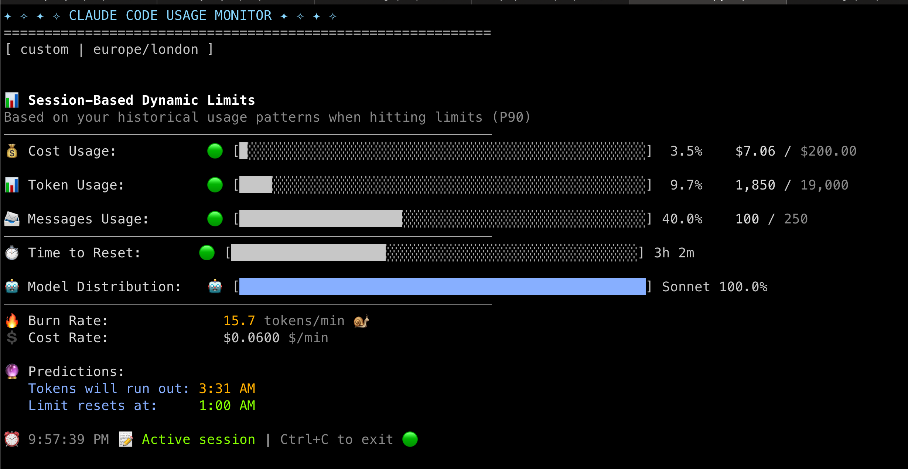
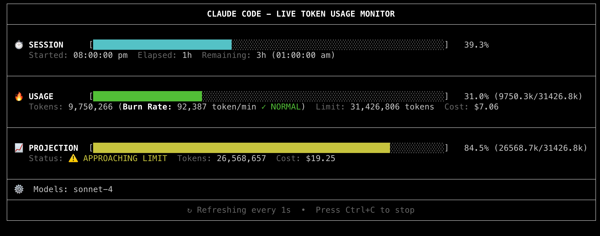

# Claude Code (CLI) - Complete MCP Server Setup


**[← Back to Main Guide](./post.md)** | **[← Previous: Claude Desktop Setup](./claude-desktop-setup.md)** | **[Next: Cursor IDE Setup →](./cursor-ide-setup.md)**


## Overview

Claude Code is Anthropic's official command-line interface (CLI) for Claude, providing terminal-based workflows for scripting, CI/CD, and automated tasks.

**Best for**: Terminal workflows, CI/CD pipelines, scripting, automation

---

## Installation

**All platforms:**
```bash
npm install -g @anthropic-ai/claude-code
```

**Verify installation:**
```bash
claude --version
```

---

## Finding the Config File via Claude Code CLI

**Navigate to config file manually**

### User settings location varies by platform:

| OS | Config Path |
|----|-------------|
| **macOS** | `~/.claude.json` |
| **Linux** | `~/.claude.json` |
| **Windows** | `%APPDATA%\.claude.json` |

-OR-

**Use keyboard shortcuts to locate them using the Finder**

**macOS:**
1. Open **Finder**
2. Press `Cmd + Shift + G` (Go to Folder)
3. Type: `~` and press Enter
4. Press `Cmd + Shift + .` to show hidden files
5. Look for `.claude.json`

**Linux:**
1. Open **File Manager** (Nautilus, Dolphin, etc.)
2. Press `Ctrl + H` to show hidden files
3. Navigate to your home directory
4. Look for `.claude.json`

**Windows:**
1. Open **File Explorer**
2. In the address bar, type: `%USERPROFILE%`
3. Press Enter
4. Press `Alt + T` → **Folder Options** → **View** tab
5. Check **"Show hidden files, folders, and drives"**
6. Look for `.claude.json`

---

## Initial Setup

**macOS/Linux:**
```bash
# Create config file
touch ~/.claude.json

# Edit
nano ~/.claude.json
```

**Windows (PowerShell):**
```powershell
# Create config file
New-Item -Path $env:USERPROFILE\.claude.json -ItemType File -Force

# Edit
notepad $env:USERPROFILE\.claude.json
```

---

## Understanding Your Config File Structure

Before adding MCP servers, you need to understand what's already in your config file. Here are the common scenarios:

**Scenario 1: Empty or New Config File**
If your `.claude.json` is empty or doesn't exist, you'll create the entire structure:

```json
{
  "mcpServers": {
    // Your MCP server configurations go here
  }
}
```

**Scenario 2: Existing Config with Empty mcpServers**
Your config might look like this:
```json
{
  "apiKey": "your-api-key-here",
  "mcpServers": {}
}
```

**Scenario 3: Existing Config with Populated mcpServers**
Your config might already have MCP servers:
```json
{
  "apiKey": "your-api-key-here",
  "mcpServers": {
    "existing-server": {
      "command": "npx",
      "args": ["-y", "some-existing-server"],
      "type": "stdio"
    }
  }
}
```

---

## How to Locate and Edit the mcpServers Section

**Step 1: Open your config file**
```bash
# macOS/Linux
nano ~/.claude.json
# or
code ~/.claude.json

# Windows
notepad %USERPROFILE%\.claude.json
# or
code %USERPROFILE%\.claude.json
```

**Step 2: Find the mcpServers section**
- Look for `"mcpServers":` in the file
- If it doesn't exist, you'll need to add it
- If it exists but is empty `{}`, you'll add servers inside the braces
- If it has existing servers, you'll add new ones alongside them

**Step 3: Add your MCP server configuration**
- **For empty config**: Add the entire structure (see examples below)
- **For existing config**: Add new servers inside the existing `mcpServers` object
- **Always ensure proper JSON syntax** with commas between multiple servers

**Example: Adding to existing config with other servers**
```json
{
  "apiKey": "your-api-key-here",
  "mcpServers": {
    "existing-server": {
      "command": "npx",
      "args": ["-y", "some-existing-server"],
      "type": "stdio"
    },
    "new-memory-server": {
      "command": "npx",
      "args": ["-y", "@modelcontextprotocol/server-memory"],
      "type": "stdio"
    }
  }
}
```

**Step 4: Validate your JSON**
```bash
# macOS/Linux
cat ~/.claude.json | python3 -m json.tool

# Windows (PowerShell)
Get-Content $env:USERPROFILE\.claude.json | ConvertFrom-Json
```

---

## ⚠️ CRITICAL DIFFERENCE

**Claude Code requires `"type": "stdio"` in every MCP server configuration!**

This is the #1 reason configs fail. Claude Desktop and Cursor don't need this field.

---

## Configuration Options

### Option 1: Shared Memory Setup

**Step 1: Create shared memory file** (if not already created)

**macOS/Linux:**
```bash
mkdir -p ~/claude-mcp-configs
touch ~/claude-mcp-configs/shared-memory.json
```

**Windows (PowerShell):**
```powershell
New-Item -Path $env:USERPROFILE\claude-mcp-configs -ItemType Directory -Force
New-Item -Path $env:USERPROFILE\claude-mcp-configs\shared-memory.json -ItemType File -Force
```

**Step 2: Install memory server**
```bash
npm install -g @modelcontextprotocol/server-memory
```

**Step 3: Add to config**

**macOS/Linux config:**
```json
{
  "mcpServers": {
    "shared-memory": {
      "command": "npx",
      "args": [
        "-y",
        "@modelcontextprotocol/server-memory",
        "--memory-file",
        "/Users/YOUR_USERNAME/claude-mcp-configs/shared-memory.json"
      ],
      "type": "stdio"
    }
  }
}
```

**⚠️ CRITICAL**: Replace `YOUR_USERNAME` with your actual username!

**Windows config:**
```json
{
  "mcpServers": {
    "shared-memory": {
      "command": "npx",
      "args": [
        "-y",
        "@modelcontextprotocol/server-memory",
        "--memory-file",
        "C:\\Users\\YOUR_USERNAME\\claude-mcp-configs\\shared-memory.json"
      ],
      "type": "stdio"
    }
  }
}
```

**⚠️ CRITICAL**: Replace `YOUR_USERNAME` with your actual username!

### Option 2: Advanced Setup (Combined steps)

```json
{
  "mcpServers": {
    "memory": {
      "command": "npx",
      "args": ["-y", "@modelcontextprotocol/server-memory"],
      "type": "stdio"
    },
    "filesystem": {
      "command": "npx",
      "args": [
        "-y",
        "@modelcontextprotocol/server-filesystem",
        "/path/to/allowed/directory"
      ],
      "type": "stdio"
    },
    "sequential-thinking": {
      "command": "npx",
      "args": ["-y", "@modelcontextprotocol/server-sequential-thinking"],
      "type": "stdio"
    }
  }
}
```

**Install servers:**
```bash
npm install -g @modelcontextprotocol/server-memory
npm install -g @modelcontextprotocol/server-filesystem
npm install -g @modelcontextprotocol/server-sequential-thinking
```

### Option 3: Simple Setup (mcp-cursor - Quicker, less flexible)

```json
{
  "mcpServers": {
    "mcp-cursor": {
      "command": "npx",
      "args": ["-y", "mcp-cursor"],
      "type": "stdio"
    }
  }
}
```

**Install the server:**
```bash
npm install -g mcp-cursor
```

---

## Verification

### Step 1: Verify Config File Exists and is Valid

**Check if config file exists:**
```bash
# macOS/Linux
ls -la ~/.claude.json

# Windows (PowerShell)
Test-Path $env:USERPROFILE\.claude.json
```

**Validate JSON syntax:**

**macOS/Linux:**
```bash
cat ~/.claude.json | python3 -m json.tool
```

**Windows (CMD):**
```cmd
type %USERPROFILE%\.claude.json | python -m json.tool
```

**Windows (PowerShell):**
```powershell
Get-Content $env:USERPROFILE\.claude.json | ConvertFrom-Json
```

### Step 2: Verify MCP Servers are Loaded

**Check MCP servers:**
```bash
claude mcp list
```

**Expected output:**
```
Available MCP servers:
- shared-memory (active)
- filesystem (active)
...etc..
```

### Step 3: Test MCP Functionality in Claude Code

**Start Claude Code session:**
```bash
claude
```

**Test commands in the interactive session:**

**Test 1: Check available tools**
```
What MCP tools do you have access to?
```

**Test 2: Test Memory Server**
```
Remember that my project is called "MyAwesomeApp"
```

**Test 3: Verify Memory Persistence**
```
What's my project name?
```

**Expected responses:**
- Should list all configured MCP servers
- Should confirm memory storage
- Should return "MyAwesomeApp" from memory

### Step 4: Advanced Verification Commands

**Check server status:**
```bash
claude mcp status
```

**Test specific server:**
```bash
claude mcp test memory
```

**View server logs:**
```bash
claude mcp logs
```

### Step 5: Troubleshooting

**If `claude mcp list` shows no servers:**
1. Check JSON syntax with validation commands above
2. Verify all file paths are correct (no `YOUR_USERNAME` placeholders)
3. Ensure `"type": "stdio"` is present in all server configs
4. Restart terminal and try again

**If servers show as inactive:**
1. Check if MCP packages are installed: `npm list -g | grep mcp`
2. Verify server commands are correct
3. Check for port conflicts

### No Restart Needed!

Claude Code automatically picks up config changes. Just start a new session:
```bash
claude
```

### Step 6: Monitoring: Claude Code Monitoring and Usage Analytics

**Claude Code includes powerful monitoring and usage tracking capabilities:**

**claude-monitor**: Real-time monitoring of Claude Code sessions
- **Session tracking**: Monitor active Claude Code sessions and their status
- **Performance metrics**: Track response times, token usage, and session duration
- **Resource monitoring**: Monitor CPU, memory, and network usage during sessions
- **Usage patterns**: Analyze how you use Claude Code across different projects

```bash
claude-monitor
```


**ccuage**: Usage analytics and insights for Claude Code
- **Usage statistics**: Track total tokens used, sessions created, and time spent
- **Cost analysis**: Monitor API usage and associated costs
- **Productivity metrics**: Analyze coding efficiency and AI assistance patterns
- **Historical data**: View usage trends over time

```bash
ccusage blocks --live
```



**Note:** you can find out using these tools, how far are you into the session, before it's going to end (CC will let you know your session reset time).

---

**[← Back to Main Guide](./post.md)** | **[← Previous: Claude Desktop Setup](./claude-desktop-setup.md)** | **[Next: Cursor IDE Setup →](./cursor-ide-setup.md)**
