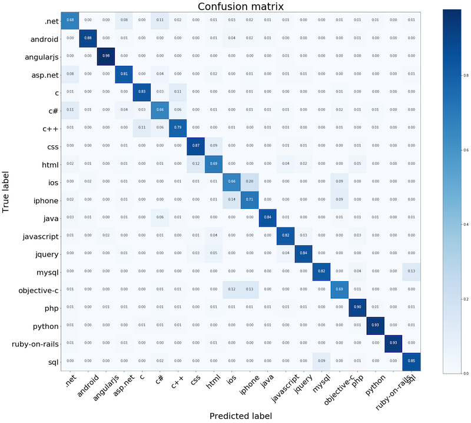

### Metrics

Accuracy, tells us the percentage of comments it assigned the correct label to (results after running the test set against the model that has been trained with the training set)

```python
[continuation from previous snippet]
.
.
.
# compile model: using loss function crossentropy, optimizer adam, evaluating the accuracy metrics
model.compile(loss='categorical_crossentropy', 
              optimizer='adam', 
              metrics=['accuracy'])
```

### Epoch

How many times the model should train on an entire dataset

### Dataset split: training, test and validation

```text
<---------------------------- original dataset ------------------->
<------------------- 80%: training ------------ | 20%: testing --->
<----- 90%: training --- | 10%: validation ---->|
```

**Note:** this part of ML has some anomalies in the terms used. Validation set is also referred to as _dev set_. Also in the case of thist post, both test and validation sets are derived from the original dataset i.e. training dataset. Traditional or expected practise is to have separate datasets isolated from the original or training dataset. Also to get a better and also a fairer test and validation scores, try to use [K-fold](https://machinelearningmastery.com/k-fold-cross-validation/) or other forms of [Cross-validation](https://en.wikipedia.org/wiki/Cross-validation_(statistics)) methods, which shuffle and mix-and-match the datasets to perform both the test and validation steps.

**Source code**
```python
[continuation from previous snippet]
.
.
.
# x_train = training data (features) 
# y_train = labels (target)
# Train the model using the training set and various training parameters: batch_size, epoch, validation_split
batch_size=40000
history = model.fit(x_train, y_train, 
                    batch_size=batch_size, 
                    epochs=2, 
                    verbose=1, 
                    validation_split=0.1)

# Accuracy: applying the test training set on the model
score = model.evaluate(x_test, y_test, 
                       batch_size=batch_size, verbose=1)
print('Test score:', score[0])
print('Test accuracy:', score[1])
```

**Output**

```bash
$ time python -W ignore keras-so-posts.py
Using TensorFlow backend.
Train on 28800 samples, validate on 3200 samples
Epoch 1/2
28800/28800 [==============================] - 3s 116us/step - loss: 3.0113 - acc: 0.0563 - val_loss: 2.9081 - val_acc: 0.1284
Epoch 2/2
28800/28800 [==============================] - 3s 97us/step - loss: 2.9054 - acc: 0.1338 - val_loss: 2.8150 - val_acc: 0.2166
8000/8000 [==============================] - 0s 40us/step
Test score: 2.8183021545410156
Test accuracy: 0.22212499380111694
python -W ignore keras-so-posts.py  32.23s user 1.95s system 113% cpu 30.121 total
```


### Confusion matrix

A confusion matrix is a great way to see how many questions the model tagged correctly, and where mistakes were most commonly made. 

**Source code**

```python
[continuation from previous snippet]
.
.
.
# This utility function is from the sklearn docs: http://scikit-learn.org/stable/auto_examples/model_selection/plot_confusion_matrix.html
def plot_confusion_matrix(cm, classes,
                          title='Confusion matrix',
                          cmap=plt.cm.Blues):
    """
    This function prints and plots the confusion matrix.
    Normalization can be applied by setting `normalize=True`.
    """

    cm = cm.astype('float') / cm.sum(axis=1)[:, np.newaxis]

    plt.imshow(cm, interpolation='nearest', cmap=cmap)
    plt.title(title, fontsize=30)
    plt.colorbar()
    tick_marks = np.arange(len(classes))
    plt.xticks(tick_marks, classes, rotation=45, fontsize=22)
    plt.yticks(tick_marks, classes, fontsize=22)

    fmt = '.2f'
    thresh = cm.max() / 2.
    for i, j in itertools.product(range(cm.shape[0]), range(cm.shape[1])):
        plt.text(j, i, format(cm[i, j], fmt),
                 horizontalalignment="center",
                 color="white" if cm[i, j] > thresh else "black")

    plt.ylabel('True label', fontsize=25)
    plt.xlabel('Predicted label', fontsize=25)

# Prepare and apply the confusion matrix on the training and test set results
y_softmax = model.predict(x_test)

y_test_1d = []
y_pred_1d = []

for i in range(len(y_test)):
    probs = y_test[i]
    index_arr = np.nonzero(probs)
    one_hot_index = index_arr[0].item(0)
    y_test_1d.append(one_hot_index)

for i in range(0, len(y_softmax)):
    probs = y_softmax[i]
    predicted_index = np.argmax(probs)
    y_pred_1d.append(predicted_index)

text_labels = encoder.classes_
cnf_matrix = confusion_matrix(y_test_1d, y_pred_1d)
plt.figure(figsize=(24,20))
plot_confusion_matrix(cnf_matrix, classes=text_labels, title="Confusion matrix")
plt.show()
```

**Output**

