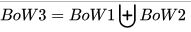

### Preprocessing data

#### Wikipedia

[https://en.wikipedia.org/wiki/Bag-of-words_model]()

**Example of implementation**

The bag-of-words model is commonly used in methods of document classification where the (frequency of) occurrence of each word is used as a feature for training a classifier.

The following models a text document using bag-of-words. Here are two simple text documents:

```
(1) John likes to watch movies. Mary likes movies too.
```
```
(2) John also likes to watch football games.
```
Based on these two text documents, a list constructed as follows for each document:

```json
"John","likes","to","watch","movies","Mary","likes","movies","too"

"John","also","likes","to","watch","football","games"
```

Representing each bag-of-words as a JSON object, and attributing to the respective Javascript variable:

```json
BoW1 = {"John":1,"likes":2,"to":1,"watch":1,"movies":2,"Mary":1,"too":1};
BoW2 = {"John":1,"also":1,"likes":1,"to":1,"watch":1,"football":1,"games":1};
```

Each key is the word, and each value is the number of occurrences of that word in the given text document.

The order of elements is free, so, for example `{"too":1,"Mary":1,"movies":2,"John":1,"watch":1,"likes":2,"to":1}` is also BoW1. It is also what we expect from a strict JSON object representation.

Note: if another document is like a union of these two,

```
(3) John likes to watch movies. Mary likes movies too. John also likes to watch football games.
```

its Javascript representation will be:

```json
BoW3 = {"John":2,"likes":3,"to":2,"watch":2,"movies":2,"Mary":1,"too":1,"also":1,"football":1,"games":1};
```

So, as we see in the bag algebra, the "union" of two documents in the bags-of-words representation is, formally, the disjoint union, summing the multiplicities of each element. 

