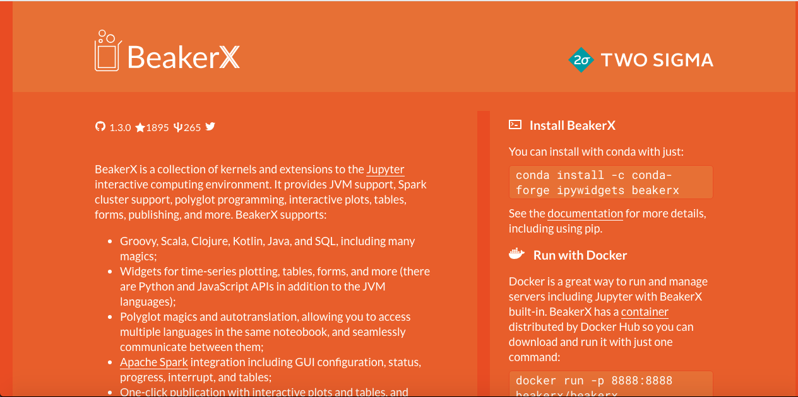

# JuPyteR [](https://hub.docker.com/r/neomatrix369/jupyter-java) [](https://opensource.org/licenses/Apache-2.0)

[JuPyteR notebooks](https://jupyter.org/) also gives us the facility to write notebooks using Java, Scala and other JVM and non-JVM languages in addition to Python, R and Julia.

In theory, the below instructions should work for all operating systems i.e. Linux, MacOS and Windows. Although it has been only tested for Linux and MacOS.

## Blogs

- [Running Jupyter notebooks on Oracle Cloud Infrastructure](https://medium.com/@neomatrix369/running-your-jupyter-notebooks-on-the-cloud-ed970326649f)

## Kernels

These are provided using via kernels, for e.g. the [IJava kernel](https://github.com/SpencerPark/IJava) when installed, provides Java language support in Jupyter notebooks. Take a look at the docs and examples provided on [https://github.com/SpencerPark/IJava](https://github.com/SpencerPark/IJava).

Pre-requisite: only supports JDK versions 9 and higher

GraalVM compiler can be enabled for JDK 9 and higher, for platforms where it is supported, see table below:

|JDK/JRE Version  | Platforms             | 
|----------------:|:----------------------|
|Java 9           | Linux only            |
|Java 10          | Linux and MacOS       |
|Java 11 or higher| Linux, MacOS, Windows |

#### Switches to enable the GraalVM compiler in Java 9

```
  export JAVA_OPTS="-XX:+UnlockExperimentalVMOptions -XX:+EnableJVMCI -XX:+UseJVMCICompiler"
  export JAVA_TOOL_OPTIONS="${JAVA_TOOL_OPTIONS} ${JAVA_OPTS}"
```

or

```
  export ENABLE_GRAALVM_COMPILER="-XX:+UnlockExperimentalVMOptions -XX:+EnableJVMCI -XX:+UseJVMCICompiler"

  java [-cp] [...] [-jar] [...] \
       ${ENABLE_GRAALVM_COMPILER}
```

### Additional source of kernels
- [beakerx](http://beakerx.com/) - Is another source where a wider range of kernels can be found (covering many JVM languages).


- [https://github.com/scijava/scijava-jupyter-kernel](https://github.com/scijava/scijava-jupyter-kernel) - aims to be a polyglot Jupyter kernel. It uses the [Scijava scripting languages](https://imagej.net/Scripting#Supported_languages) to execute the code in Jupyter client and it's possible to use different languages in the same notebook (covers a number of JVM languages).

- [https://github.com/ligee/kotlin-jupyter](https://github.com/ligee/kotlin-jupyter) - Basic kotlin (1.2.21) REPL kernel for jupyter


- [Wikipedia of Jupyter kernels](https://github.com/jupyter/jupyter/wiki/Jupyter-kernels) - a list of available kernels, add yours to the list in case it isn't mentioned.

### Write kernels

Check out the project [https://github.com/SpencerPark/jupyter-jvm-basekernel](https://github.com/SpencerPark/jupyter-jvm-basekernel) in order to embark into the world of kernel creation, maybe the [example folder](https://github.com/SpencerPark/jupyter-jvm-basekernel/tree/master/example) is a good one to look at as well.

## Get started: Automated (via scripts)

### Source location

Go to example [project root](../JuPyteR) to perform the commands mentioned in the sections below.

### Local environment

```
$ cd build-docker-image

$ [install Java 9 SDK and set the PATH and JAVA_HOME]
$ ./install-jupyter-notebooks.sh
$ ./install-java-kernel.sh
```

We should see the below two sets of outputs:

```
Installing Jupyter notebook and dependencies
JDK9/JDK11, Linux only: We are enabling JVMCI flags (enabling Graal as Tier-2 compiler)
Graal setting: please check docs for higher versions of Java and for other platforms
PATH=/opt/java/openjdk//bin:/opt/java/openjdk/bin:/usr/local/sbin:/usr/local/bin:/usr/sbin:/usr/bin:/sbin:/bin
JAVA_OPTS=-XX:+UnlockExperimentalVMOptions -XX:+EnableJVMCI -XX:+UseJVMCICompiler
Picked up JAVA_TOOL_OPTIONS: -XX:+UnlockExperimentalVMOptions -XX:+UseCGroupMemoryLimitForHeap -XX:+UnlockExperimentalVMOptions -XX:+EnableJVMCI -XX:+UseJVMCICompiler
openjdk 9.0.4
...
Successfully installed MarkupSafe-1.1.1 Send2Trash-1.5.0 attrs-19.1.0 backports-abc-0.5 backports.shutil-get-terminal-size-1.0.0 bleach-3.1.0 configparser-3.8.1 decorator-4.4.0 defusedxml-0.6.0 entrypoints-0.3 enum34-1.1.6 functools32-3.2.3.post2 futures-3.3.0 ipaddress-1.0.22 ipykernel-4.10.1 ipython-5.8.0 ipython-genutils-0.2.0 ipywidgets-7.5.1...
```

and

```
A list of already installed kernels in your jupyter environment
Available kernels:
  python2    /[User home]/[path/to]/jupyter/kernels/python2
Downloading the Java kernel version 1.2.0
  % Total    % Received % Xferd  Average Speed   Time    Time     Time  Current
                                 Dload  Upload   Total   Spent    Left  Speed
100   606    0   606    0     0   1419      0 --:--:-- --:--:-- --:--:--  1415
100 5397k  100 5397k    0     0  2321k      0  0:00:02  0:00:02 --:--:-- 4213k
Unzipping the Java kernel version 1.2.0
Archive:  ijava-1.2.0.zip
   creating: java/
  inflating: java/ijava-1.2.0.jar
  inflating: java/kernel.json
   creating: java/dependency-licenses/
   creating: java/dependency-licenses/commons-io-2.5.jar/
   [...snipped...]
  inflating: install.py
Using the install.py command to install Java kernel version 1.2.0.
[InstallKernelSpec] Installed kernelspec java in /[path/to]/jupyter/kernels/java
A list of already installed kernels in your jupyter environment
Available kernels:
  java       /[User home]/[path/to]/jupyter/kernels/java
  python2    /[User home]/[path/to]/share/jupyter/kernels/python2
```

### Docker container

See [Docker container instructions](Docker-container-instructions.md)

## Get started: Manual steps (via CLI)

### Check for available kernels

Let's find out what exists in our development environment:

```
$ jupyter kernelspec list
```

Here is a sample output depending on what is installed in our development environment:

```
Available kernels:
  python2    /[User home]/[path/to]/jupyter/kernels/python2
```

Output might vary slightly depending on how your `python` environment has been setup.

### Download and unzip the kernel (from pre-compiled binary release)

Download the [IJava kernel](https://github.com/SpencerPark/IJava) version 1.2.0 with:

```
$ curl -L https://github.com/SpencerPark/IJava/releases/download/v1.2.0/ijava-1.2.0.zip -O ijava-1.2.0.zip

### ~~~ choose a destination to unzip the archive ~~~

$ unzip ijava-1.2.0.zip
```

### Install the kernel

**Pre-requisite:** _Java 9_ should be the current JDK your *JAVA_HOME* should point to, when installing the pre-compiled binary from [https://github.com/SpencerPark/IJava/releases/](https://github.com/SpencerPark/IJava/releases/)

#### Method 1: via the `jupyter` command on the command-line

```    
$ jupyter kernelspec install java
```

```
[InstallKernelSpec] Installed kernelspec java in /[path/to]/jupyter/kernels/java
```

Note: destination paths may vary hence `[path/to]`.

#### Method 2: via the `python3` command on the command-line

```
$ python3 install.py --sys-prefix
```

```
Installed java kernel into "/[path/to]/jupyter/kernels/java"
```

Note: destination paths may vary hence `[path/to]`.

### Recheck for the now available kernels

Let's find out if the installation was successful:

```
$ jupyter kernelspec list
```

We could expect an output like the below:

```
Available kernels:
  java       /[User home]/[path/to]/jupyter/kernels/java
  python2    /[User home]/[path/to]/jupyter/kernels/python2
```

Output might vary slightly depending on how your `python` environment has been setup.

### Kernel installation: variety of combinations of environments and JDKs 

See [Other kernel installation methods](Other-kernel-installation-methods.md)

Please take a glance at the above link, especially if `jupiter-notebook` or `jupyter-lab` has trouble locating the kernels.

### Removing the installed kernel

```    
$ jupyter kernelspec remove java
```

Interaction to confirm removal of the kernel:

```
Kernel specs to remove:
  java                  /[User home]/[path/to]/jupyter/kernels/java
Remove 1 kernel specs [y/N]: y
[RemoveKernelSpec] Removed /[User home]/[path/to]/jupyter/kernels/java
```

Note: destination paths may vary hence `[path/to]`.

Ensure you are currently in the right python environment to be able to remove the kernel installed in the said environment.

### Usage and examples

See [README section on SpencerPark/IJava](https://github.com/SpencerPark/IJava) for a whole number of examples and usages.

Also checkout the live links (JuPyteR notebooks online).

**Enjoy writing prototypes, experiments or do some real work with it, in Java, Scala or any other kernel of your choice.**

### Credits for the inspiration

Inspired by these tweets:

- [https://twitter.com/java/status/1081275824492371968](https://twitter.com/java/status/1081275824492371968)
- [https://twitter.com/java/status/1082365504461824000](https://twitter.com/java/status/1082365504461824000)

Thank you [@nicolas_frankel](http://twitter.com/@nicolas_frankel) and the good folks behind [beakerx.com](https://beakerx.com).

# Contributing

Contributions are very welcome, please share back with the wider community (and get credited for it)!

Please have a look at the [CONTRIBUTING](../../CONTRIBUTING.md) guidelines, also have a read about our [licensing](../../LICENSE.md) policy.

---

Back to example [project root](../JuPyteR) </br>
Back to [main page (table of contents)](../../README.md)