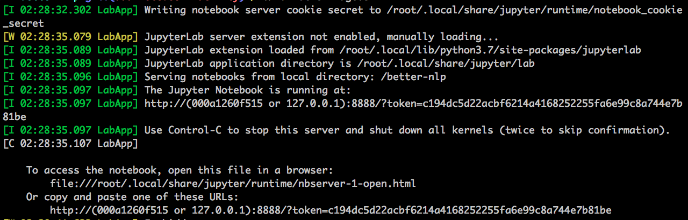
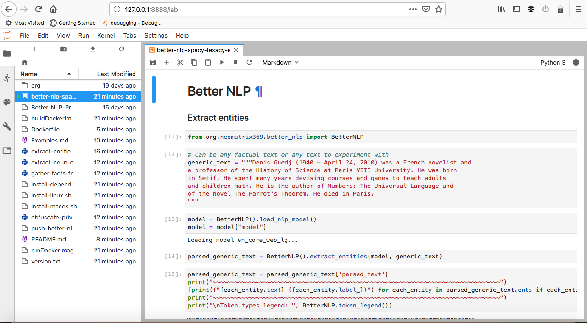

# Jupyter Notebook

### Better NLP related

See [better_nlp_spacy_texacy_examples.ipynb](../notebooks/jupyter/better_nlp_spacy_texacy_examples.ipynb) or [better_nlp_summarisers.ipynb](../notebooks/jupyter/better_nlp_summarisers.ipynb) to see the examples fleshed out in the notebook. A more efficient and easy way to work with - model needs to be loaded only once throughout the life-cycle of the kernel.

The Jupyter lab instance is executed immediately on running the `runDockerImage.sh` script. Look for mesages like these in the docker container terminal:

The above listed URL can be opened in the browser to access the notebook(s) in the current folder:

### NLP profiler

See [nlp_profiler.ipynb](https://github.com/neomatrix369/nlp_profiler/blob/master/notebooks/jupyter/nlp_profiler.ipynb)

 

Find the [NLP Profiler library here](https://github.com/neomatrix369/nlp_profiler/).

[Return to main page](../README.md)