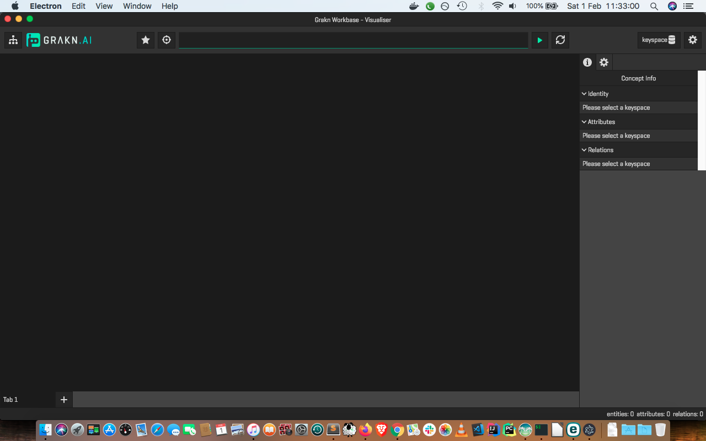
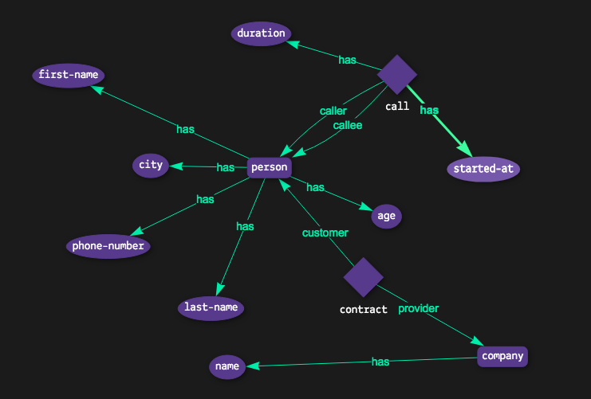

# Graql 

Speaking Graql!



## Schema

For simplicity let's pick the [Phone calls](https://github.com/graknlabs/examples/blob/master/schemas/phone-calls-schema.gql) schema.

## Data

Data for the [Phone calls](https://github.com/graknlabs/examples/blob/master/schemas/phone-calls-schema.gql) schema can be found **[here](https://github.com/graknlabs/examples/tree/master/datasets/phone-calls)**, both `xml` and `json` formats.

## Getting started

To get quickly aquainted with Grakn, Graql and Workbase, have a look at the [QuickStart guide](https://dev.grakn.ai/docs/general/quickstart) from [GraknLabs](https://grakn.ai).

Have a look especially around [Graql](https://dev.grakn.ai/docs/schema/overview) and [Workbase](https://dev.grakn.ai/docs/workbase/overview).

You may not need to do all the setup as the docker container provided (see [README](./README.md) should help get started with Grakn and Graql). See Workbase docs to see how to install and run it - this part can be trivial for many users (just download, extract and run the app).

Also, see the [Examples overview](https://dev.grakn.ai/docs/examples/phone-calls-overview) resource.

### High-level

#### Potential Questions to ask about data

- Since September 10th, which customers called the person X?
- Who are the people who have received a call from a London customer aged over 50 who has previously called someone aged under 20?
- Who are the common contacts of customers X and Y?
- Who are the customers who 
  - 1) have all called each other and 
  - 2) have all called person X at least once?
- How does the average call duration among customers aged under 20 compare with those aged over 40?

#### Domain concepts

- A **company** has a **name**, 
  - and can be the **provider** of a **contract** to a **person**,
  - who then becomes a **customer**
- A **person** has a 
  - **first** and **last name**, 
  - an **age**, 
  - a **city** they live in, 
  - and a **phone number**
- A **person** who doesn’t have 
  - a registered **contract** (not a **customer**) 
  - has only a **phone number**
- A **call**, 
  - made from a **person** (**caller**) to another **person** (**callee**), 
  - has a **duration** as well as
  - the **date** 
  - and **time** when the **call** has been made

#### Reorganising, classifying and naming the concepts

**Relations**
- call is of _type relation_ that has two role players
  - person who plays the role of a caller
  - and (another) person who plays the role of a callee
- contract is also of _type relation_ that has two role players
  - company who plays the role of a provider
  - and person who plays the role of a customer

**Entities**
- company and person are of _type entity_

**Attributes**
- first-name, last-name, phone-number, city, age, started-at and duration are of _type attribute_



## English-to-Graql

See [English to Graql](./English-to-Graql.md)

## Graql-to-English

See [Graql to English](./Graql-to-English.md)

## Running CLI interface for PoC

Before doing this ensure that your database instance (local or Docker) has the data applied as expected by following the [Schema](README.md#schema) and [Data](README.md#data) steps. Otherwise the below queries won't return a good response. To find out the results of the interactions, also open the [presentation](../presentation/GraknCosmos2020/Naturally,-getting-productive,-my-journey-with-Grakn-and-Graql.pdf) alongside.

```
(from parent folder, run the below)
$ ./grakn-runner.sh --run-grakn-only --runContainer

(once the Grakn server is ready, run the below using Python3)
$ ./run-python-in-docker.sh

(inside the docker container follow the steps mentioned)
$ pip install -r requirements.txt

$ python grakn_console_client.py
```

When presented with the prompt:
```
GraqlBot: English or Graql >
```

Any one of these queries can be tried out:
```
show schema
```
or
```
Give me a list of customers calling each other in London or Cambridge
```
or
```
Since September which customers called
```
or
```
Calls related to September 10th or 14th
```
or a Graql query like:
```
graql: match $customer isa person, has age < 20; $company isa company, has name "Telecom"; (customer: $customer, provider: $company) isa contract; (caller: $customer, callee: $anyone) isa call, has duration $duration; get $duration; mean $duration;
```
## Resources

- [Workbase overview](https://dev.grakn.ai/docs/workbase/overview)
- [Download Workbase](https://grakn.ai/download#workbase)
- [Query pattern](https://dev.grakn.ai/docs/pattern/overview)
- [Natural Language Processing for Fuzzy String Matching with Python](https://towardsdatascience.com/natural-language-processing-for-fuzzy-string-matching-with-python-6632b7824c49)
- [Words of estimative probability](https://en.wikipedia.org/wiki/Words_of_estimative_probability)

## Disclaimer

All the code and scripts container in this folder and the main folder `grakn` are a proof-of-concept work to illustrate use-case(s) and usage scenarios. It is not mean to be a full-fledge solution and is adapted to a certain dataset and hence all of the behaviours are in that order.

The code (this repo) and the referred datasets (see Grakns' docs and git repos)are available as F/OSS. The code is available here under the Apache license, see [license.txt](../license.txt) and can be used/changed accordingly. Grakn's resources are available under their said licenses (please check accordingly).

---

[back to README](../README.md)