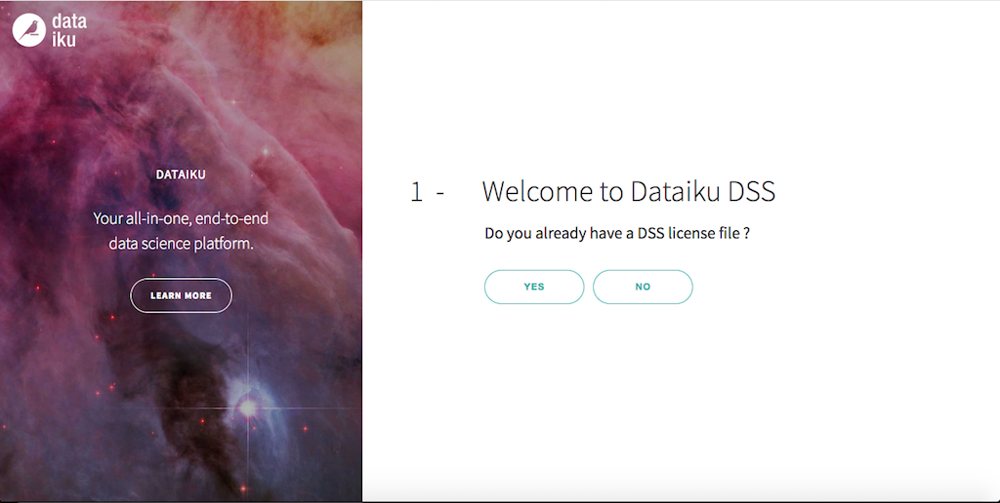
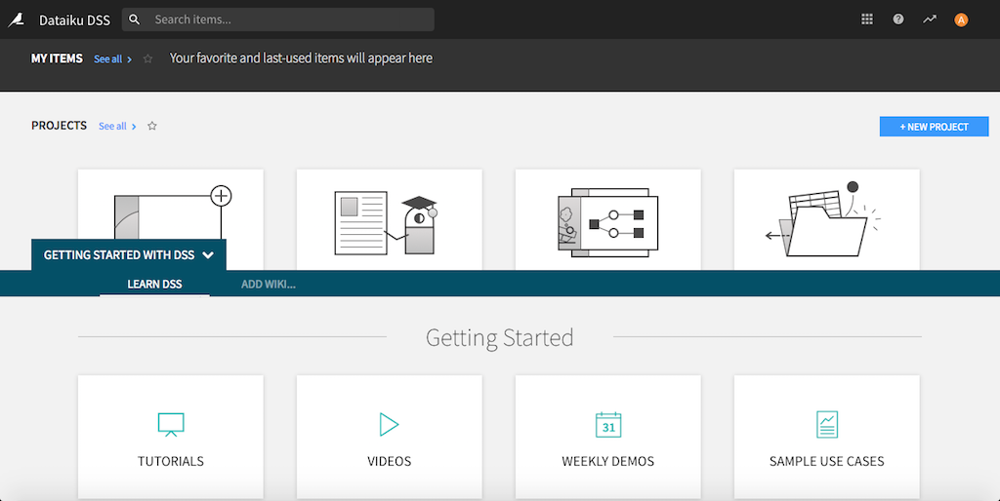
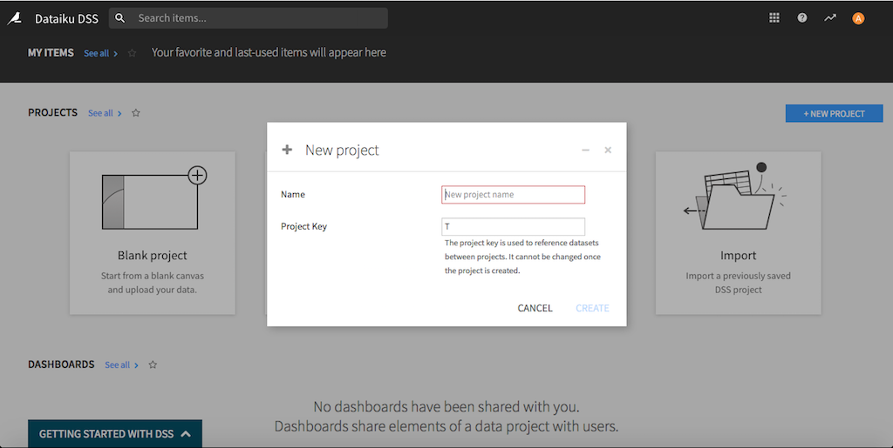

# Successful run console





## Traditional JDK (JDK8)

**Command**
```
 DETACHED_MODE=true JDK_TO_USE="" ./runDssInDocker.sh
```

**Output**

```

~~~ Running DSS in a Docker container using the Traditional JDK (version 1.8)
+ docker run --rm --detach -p 10000:10000 --workdir /home/dataiku --env JDK_TO_USE=Traditional-JDK --env DSS_VERSION=5.1.4 --env JAVA_OPTS= --env DSS_PORT=10000 --env HOME=/home/dataiku --env DSS_DATADIR=/home/dataiku/dss --user dataiku neomatrix369/dataiku-dss:5.1.4
+ set +x
Traditional-JDK: DSS in the container is now starting (id = 11f22e6)
..............................................................................
Traditional-JDK: DSS in the container is now running.
Traditional-JDK: Shutting down DSS in the container (id = 11f22e6)
11f22e6
Traditional-JDK: DSS in the container (id = 11f22e6) has been shutdown.


real  0m17.608s
user  0m12.281s
sys 0m2.113s

```

Control waits at the Graql prompt. Execution times at different stages are recorded and displayed. Other environment specific details are also printed in the console.

## Polyglot JDK (GraalVM) - JVMCI disabled

This version of GraalVM is based on JDK8, run with JVMCI disabled.

**Command**

```
 DETACHED_MODE=true JDK_TO_USE="GRAALVM" JAVA_OPTS=-XX:-UseJVMCINativeLibrary ./runDssInDocker.sh
```

```

~~~ Running DSS in a Docker container using the GraalVM (version 1.8), JVMCI disabled
+ docker run --rm --detach -p 10000:10000 --workdir /home/dataiku --env JDK_TO_USE=GRAALVM --env DSS_VERSION=5.1.4 --env JAVA_OPTS=-XX:-UseJVMCINativeLibrary --env DSS_PORT=10000 --env HOME=/home/dataiku --env DSS_DATADIR=/home/dataiku/dss --user dataiku neomatrix369/dataiku-dss:5.1.4
+ set +x
GRAALVM: DSS in the container is now starting (id = 20c9d2d)
...........................................................................
GRAALVM: DSS in the container is now running.
GRAALVM: Shutting down DSS in the container (id = 20c9d2d)
20c9d2d
GRAALVM: DSS in the container (id = 20c9d2d) has been shutdown.


real  0m19.550s
user  0m13.247s
sys 0m2.576s

``` 

## Polyglot JDK (GraalVM) - JVMCI enabled

This version of GraalVM is based on JDK8, run with JVMCI enabled (default setting).

**Command**

```
 DETACHED_MODE=true JDK_TO_USE="GRAALVM" JAVA_OPTS=-XX:+UseJVMCINativeLibrary ./runDssInDocker.sh
```

```

~~~ Running DSS in a Docker container using the GraalVM (version 1.8), JVMCI enabled
+ docker run --rm --detach -p 10000:10000 --workdir /home/dataiku --env JDK_TO_USE=GRAALVM --env DSS_VERSION=5.1.4 --env JAVA_OPTS=-XX:+UseJVMCINativeLibrary --env DSS_PORT=10000 --env HOME=/home/dataiku --env DSS_DATADIR=/home/dataiku/dss --user dataiku neomatrix369/dataiku-dss:5.1.4
+ set +x
GRAALVM: DSS in the container is now starting (id = e8d263d)
............................................................................
GRAALVM: DSS in the container is now running.
GRAALVM: Shutting down DSS in the container (id = e8d263d)
e8d263d
GRAALVM: DSS in the container (id = e8d263d) has been shutdown.


real  0m20.247s
user  0m13.752s
sys 0m2.624s

``` 

[Back to Dakaiku DSS Main Page](./README.md#dataiku-data-science-studio-dss)