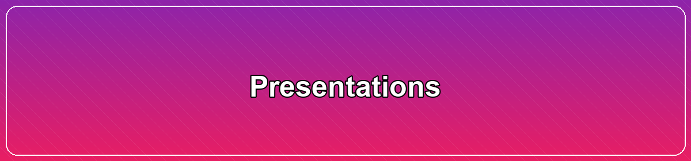

# 🖥️ Presentations
> Slide decks and talk links across AI/ML/DL, Data, and NLP.

[Home](../README.md) · [🧪 Examples](../examples/apache-zeppelin/README.md) · [📓 Notebooks](../notebooks/README.md) · [📊 Data](../data/README.md) · [🧠 NLP](../natural-language-processing/README.md) · [🧰 Tools](../tools/README.md)

Use this index to explore project overviews, workshops, and community talks with slides and recordings where available.

## At a glance
- **Talks with slides**: curated links to PDFs and recordings
- **Workshop materials**: notebooks and code when available
- **Related**: jump to notebooks, examples, and data resources

## Related
- [Notebooks](../notebooks/README.md)
- [Data](../data/README.md)
- [NLP](../natural-language-processing/README.md)

- On AI/ML/DL related topics, see [awesome-ai-ml-dl](awesome-ai-ml-dl)
- On Data related topics, see [data](data)
- On NLP related topics, see [nlp](nlp)
- Better NLP: [First presentation: launch of Better NLP](../examples/better-nlp/presentations/09-Mar-2019/Better-NLP-Presentation-Slides.pdf) | [Follow-up presentation of Better NLP](../examples/better-nlp/presentations/29-Jun-2019/Better-NLP-2.0-one-library-rules-them-all-Presentation-Slides.pdf)
- NLP Profiler: [Demo](https://github.com/neomatrix369/nlp_profiler/#demo) | [First presentation: Abhishek Talks](https://youtu.be/sdPOyqMfK7M?t=2274) | [Follow-up presentation: NLP Zurich](https://github.com/neomatrix369/nlp_profiler/tree/master/presentations/01-nlp-zurich-2020)

# Contributing

Contributions are very welcome, please share back with the wider community (and get credited for it)!

Please have a look at the [CONTRIBUTING](../CONTRIBUTING.md) guidelines, also have a read about our [licensing](../LICENSE.md) policy.

---

#presentations · [← Back home](../README.md)
